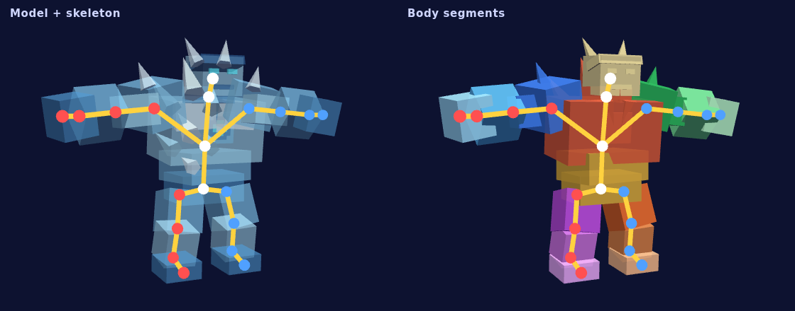
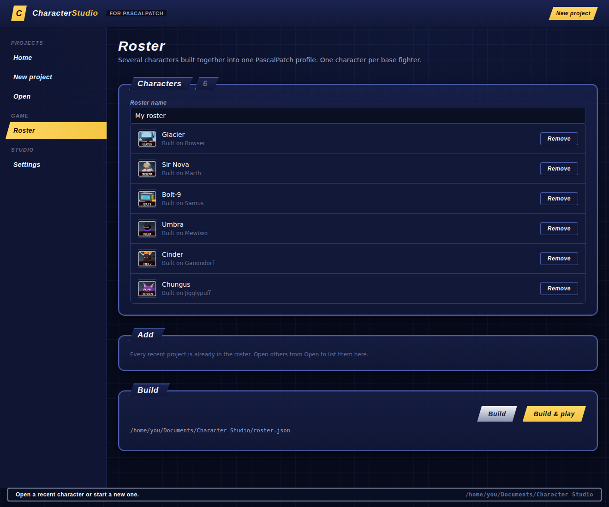

# Melee Character Studio

**Make your own Super Smash Bros. Melee fighters from 3D models**, and play them offline in
[Melee Unlocked](https://github.com/hero88go/melee-unlocked) through
[PascalPatch](https://github.com/Dylan-Demolder/PascalPatch).

Bring a `.glb`, `.obj` or zipped `.gltf`, and pick the Melee fighter whose skeleton and
animations it builds on. The studio fits your model to that skeleton. Then you can retune moves,
borrow specials from other fighters and change stats, with frame data and KO percents that
update as you go. **Test in game** builds the fighter and drops you straight into a match with
it.


## Example characters

Six original fighters come with the studio, ready to play or take apart. Each one is a new
fighter on the character select screen, so no original fighter is replaced.

|  |  |  |  |  |  |
|:-:|:-:|:-:|:-:|:-:|:-:|
| **Glacier**<br>Bowser | **Sir Nova**<br>Marth | **Bolt-9**<br>Samus | **Umbra**<br>Mewtwo | **Cinder**<br>Ganondorf | **Chungus**<br>Jigglypuff |
| Ice golem: specials and smashes freeze | Star knight with an electric blade | Heavy, grounded storm robot | Shadow ninja with dark-element strikes | Fire demon: every special burns | Round bat with Fox's and Luigi's specials |

To play them, open **Roster**, press **+ All examples**, then **Build & play**.
[examples/](examples/README.md) has each character's moves, how they were made, and a testing
checklist.

## Get it

Character Studio comes in the PascalPatch download:

1. Download PascalPatch from its
   [latest release](https://github.com/Dylan-Demolder/PascalPatch/releases/latest), unzip it,
   and run **`PascalPatch.exe`**.
2. In PascalPatch, make a profile with your Melee disc (NTSC 1.02 `.iso`).
3. Press **Character Studio** at the top of the app.

Nothing else needs installing. The studio reads the base fighters from your own disc and writes
what it builds to PascalPatch's folders.

## Make a character

1. **New project**: drop in your model. Pick a name, the base fighter, and which way the model
   faces. The joints are placed automatically as a first guess.
2. Work through the editor's modes (keys 1–7):

   | Mode | What you do |
   |---|---|
   | **Fit** | Drag the base skeleton's joints onto your model |
   | **Body parts** | Paint which bone each area follows: fixes capes, hair and baggy clothes |
   | **Sculpt** | Grab, smooth, inflate and deflate brushes, with X symmetry |
   | **Animate** | Watch the base fighter's real animations on your model |
   | **Moves** | Pick each special from any fighter, borrow normal attacks, retune hitboxes. Every move shows its frame data and the percent it KOs at |
   | **Stats** | Attribute sliders, each compared with all 26 fighters, plus a survival table |
   | **Build** | A check for problems and balance outliers, then the build |

   

   *Glacier's fit: the joints (white down the middle, red on the character's right, blue on its left)
   and bones the model is bound to, and the body segment each part of the mesh follows. Drawn
   from the project's `rig.json` and `model/model.gltf`.*

3. **Test in game** (in Build): pick the opponent, the stage, and whether player 2 is a human,
   a Training Lab dummy or a CPU. The game starts straight in that match.
4. **Roster**: put several characters together, then **Build & play**.



Edits autosave a few seconds after each change. **File > Save as** copies a project to a new
folder. Undo and redo (Ctrl+Z / Ctrl+Y) cover every edit.

### Where things live

- **A project** is a folder: `character.json` (name, stats), `moveset.json` (move edits),
  `rig.json` (the fit), and `model/` (your model and textures).
- **New projects** go in `Documents/Character Studio`, unless you pick another folder in
  Settings. The roster is `roster.json` in that folder.
- **Settings and the recent list** are in `~/.melee-character-studio/config.json`. Base-fighter
  files read from your disc are cached in `~/.melee-character-studio/cache`, never in a project.

### Limits

- Only the default costume gets your model. The other colour slots keep the vanilla look.
- Projectiles (arrows, missiles, blasters) are items, so they keep their vanilla behaviour.
- Characters use their base fighter's sounds and effects.
- **Offline only.** Custom fighters would desync against other players, so PascalPatch's
  online-safe profiles refuse them.

## From source

You need Python 3.10 or newer. No other packages are required.

```sh
PYTHONPATH=core/src python -m melee_character_studio.cli app              # opens the studio
PYTHONPATH=core/src python -m melee_character_studio.cli app --no-window  # or serve http://127.0.0.1:8766
PYTHONPATH=core/src python -m unittest discover -s core/tests             # tests
```

To use a checkout from PascalPatch's **Character Studio** button, set the Character Studio
folder in PascalPatch's Settings. `pip install -e .` also gives you a `melee-character-studio`
command.

| Folder | |
|---|---|
| `core/src/melee_character_studio/` | The studio server, HSD reader/writer, model kit and importer |
| `core/src/melee_character_studio/web/` | The app's pages and the three.js editor |
| `examples/` | The example characters (CC0) |
| `schemas/` | JSON schemas for project files |
| `docs/` | [Command line](docs/cli.md), [authoring guide](docs/authoring.md), [move sets](docs/movesets.md), [HSD validation](docs/hsd-validation.md) |

Every step the app runs can also be run on its own from the command line: building characters
and rosters, the model kit, inspecting skeletons, and converting HSD files. See
[docs/cli.md](docs/cli.md).

## Legal and license

This repository contains no Nintendo game data. Bring your own NTSC 1.02 disc, and never commit
ISOs or files read from it.

Character Studio is free software under the GNU General Public License, version 2 or (at your
option) any later version: see [LICENSE](LICENSE). The example characters in `examples/` are
CC0-1.0. three.js (MIT) is vendored under `core/src/melee_character_studio/web/vendor`.
