# Example characters

Six original fighters made with Character Studio. Each is built on a vanilla fighter's skeleton,
animations and moves, and appears as a **new fighter** on the character select screen, so no
original fighter is replaced.

Every one has an original low-poly model made with the model kit, a move set that retunes the
base fighter's hitboxes, and stat changes. Nothing here comes from the game disc. The project
files are CC0-1.0: copy them, change them, and share what you make.

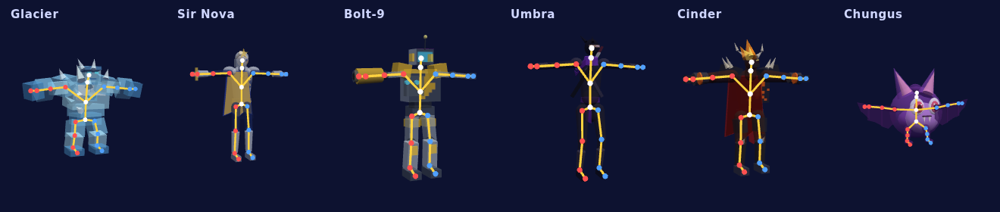

**To play them:** in the studio, open **Roster**, press **+ All examples**, then
**Build & play**. **To see how one is made:** click it under **Examples** on the start screen.
That opens your own copy, and the original stays as it came.

## Glacier

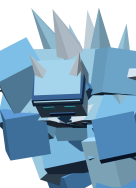

Built on Bowser (`PlKp`). An ice golem on Bowser's frame whose specials and smashes freeze foes solid.

- Ice element on every special and on the forward and down smashes: hits can freeze
- Even heavier than Bowser (x1.05)
- Crystal spikes along the back

<br clear="left">

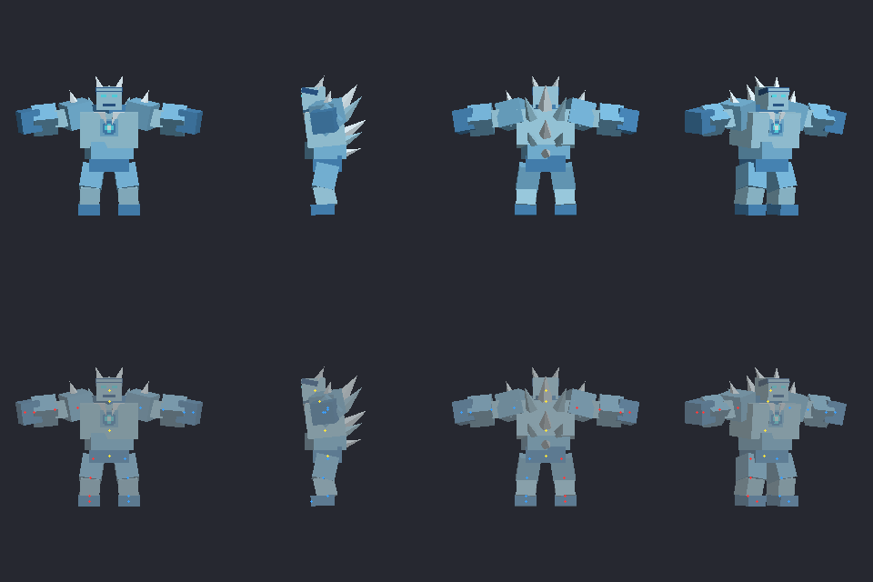

## Sir Nova

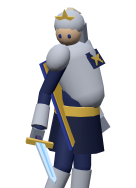

Built on Marth (`PlMs`). A star knight on Marth's frame whose starlight blade crackles with electricity.

- Starlight: electric element on specials, forward smash and down air
- Higher, floatier jumps than Marth
- Starfall Slash deals 10% more damage

<br clear="left">

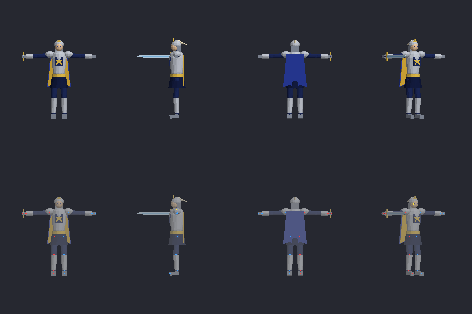

## Bolt-9

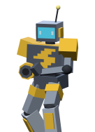

Built on Samus (`PlSs`). A storm-powered robot on Samus's frame. Heavy, grounded and electric.

- Electric element on the up special, smashes and aerial kicks
- Heavier (x1.1) and less floaty than Samus
- Arm cannon on the right forearm where Samus's cannon is

<br clear="left">

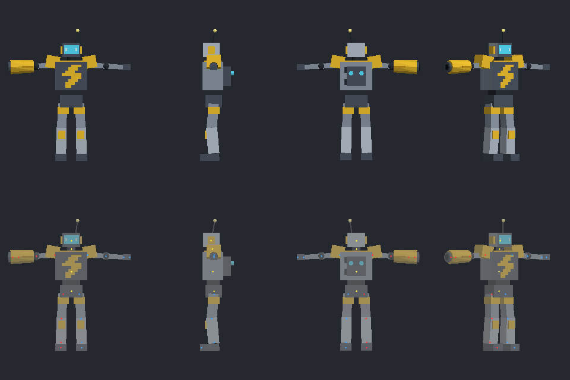

## Umbra

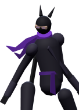

Built on Mewtwo (`PlMt`). A shadow ninja on Mewtwo's frame: teleporting shadow steps and dark-element strikes.

- Dark element on side special, forward and up smash and back air
- Faster on the ground and less floaty than Mewtwo
- Shadow Step keeps Mewtwo's teleport recovery

<br clear="left">

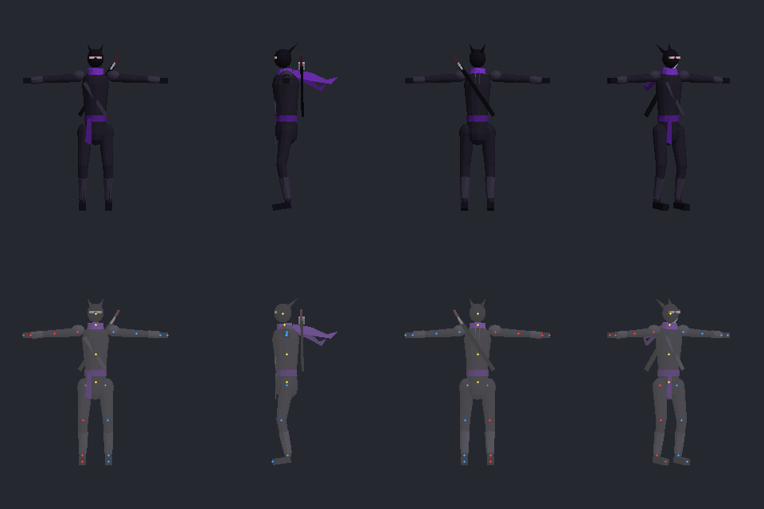

## Cinder

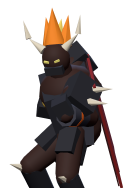

Built on Ganondorf (`PlGn`). A fire-demon warlord on Ganondorf's frame: every special burns.

- Fire element on every special, forward smash and forward air
- A touch faster on the ground than Ganondorf
- Inferno Punch deals 10% more damage

<br clear="left">

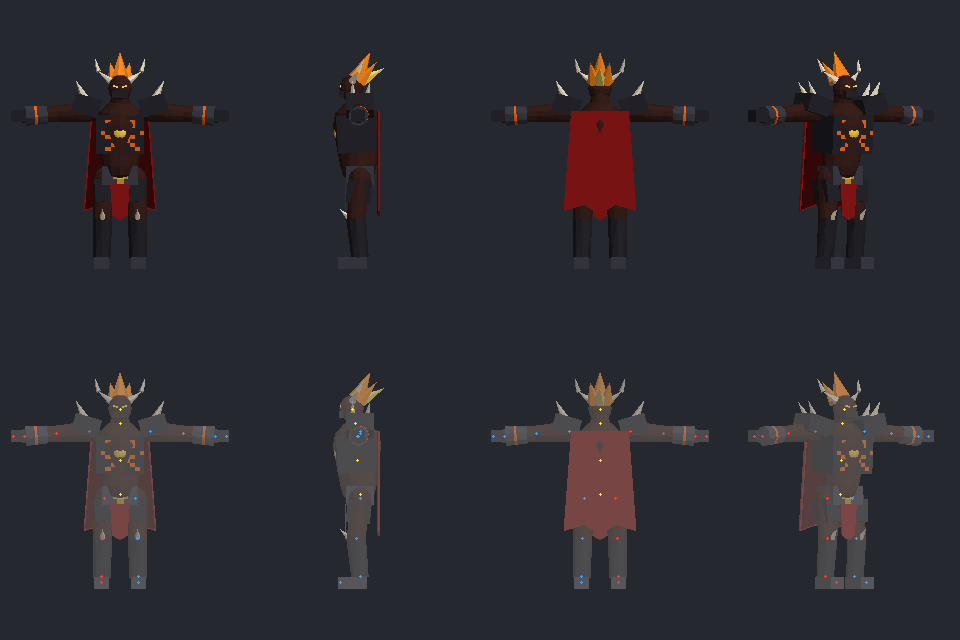

## Chungus

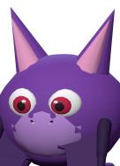

Built on Jigglypuff (`PlPr`). A round purple bat built on Jigglypuff: Jigglypuff's size, weight and air game, with Fox's up and side specials and Luigi's down special.

- Plays like Jigglypuff: same size, weight, jumps and air speed
- Night Flare (up B) is Fox's Firefox and Blaze Dash (side B) is Fox's Illusion
- Wing Cyclone (down B) is Luigi's Cyclone
- Echo Dive (neutral B) is Jigglypuff's Rollout with a dark-element hit
- Borrowed specials run through PascalPatch's move-graft plugin (offline)

<br clear="left">

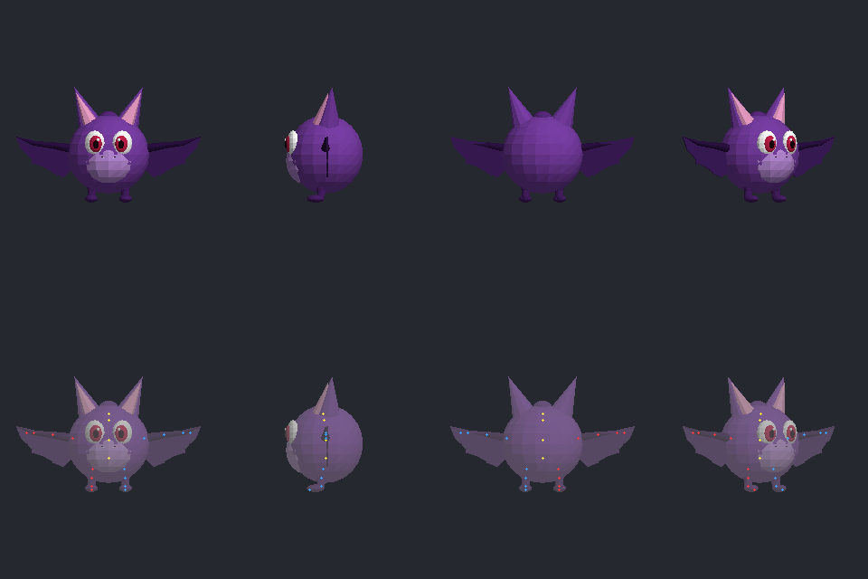

## Make your own from one

Open it and use **File > Save as**. Or copy the folder by hand: pick an unused base fighter
(`base_fighter` in `rig.json` and `moveset.json`), edit `model.json`, and list the folder in
`roster.json`. A roster has one character per base fighter.

`ember/` is an older, smaller example: a `.melee-character` package (stats and moves only, no
model) for the command-line tools.

## Project layout

```text
<name>/
  model.json      model-kit spec: palette, landmarks, primitives, pixel decals
  model/          generated: model.gltf + .bin + .png atlas, preview.png
  character.json  identity, description, features, attributes / attribute_scales
  moveset.json    moves: base action (or glob), damage/size/knockback/element edits, borrows
  rig.json        base fighter, model path, landmarks, per-segment vertex ranges
```

`attribute_scales` multiplies the base fighter's own values (`weight: 1.05`
= 5 % heavier than Bowser), so the characters stay relative to whatever
the disc says. `attributes` sets absolute values; a key can't be in both.

## Building from the command line

Run all commands from the `MeleeCharacterStudio` checkout with
`PYTHONPATH=core/src` (or install it with `pip install -e .` and use
`melee-character-studio`).

```sh
# 1. (Optional) regenerate models after editing model.json
python -m melee_character_studio.cli generate-model examples/glacier

# 2. Check how a slot's skeleton is mapped (reads your ISO, prints parts/segments)
python -m melee_character_studio.cli inspect-skeleton jigglypuff --iso /path/to/GALE01.iso

# 3. Build every character plus a PascalPatch profile
python -m melee_character_studio.cli build-roster examples/roster.json \
  --iso /path/to/GALE01.iso --out ~/melee-roster-build \
  --profile /path/to/pascalpatch-data/profiles/examples.json

#    ...or just some of them
python -m melee_character_studio.cli build-roster examples/roster.json \
  --iso /path/to/GALE01.iso --out ~/melee-roster-build --only glacier --only cinder

#    ...or one project on its own
python -m melee_character_studio.cli build-character examples/glacier \
  --iso /path/to/GALE01.iso --out ~/melee-roster-build/glacier
```

Each character gets `<out>/<name>/`, which holds:

- `<id>.melee-character`
- `PlXx.dat`, the stats and hitbox edits
- `PlXxNr.dat`, the imported model as the default costume
- `PlXxAJ.dat`, only when moves are borrowed (Chungus)

Each `.dat` has its report next to it. `<out>/roster-report.json` lists the steps, warnings and failures for every character. If one character fails, the rest still build.

Then in PascalPatch:

```sh
pascalpatch --root /path/to/pascalpatch-data profile validate examples
pascalpatch --root /path/to/pascalpatch-data build examples
pascalpatch --root /path/to/pascalpatch-data launch examples --runtime native --allow-unsafe \
  --port /path/to/melee_port.exe --port-cwd /path/to/melee-unlocked
```

The profile is `mode: offline`, so launching needs `--allow-unsafe`. Custom characters won't work on Slippi or netplay, and netplay-safe profiles refuse them.

## Testing checklist

All six have been built from a GALE01 v1.02 disc and played in offline VS matches. The bugs
that pass found are listed in [docs/authoring.md](../docs/authoring.md#validated-on-a-disc). To
re-check after changes:

1. Run `inspect-skeleton <slot> --iso …` for each slot and check that the parts include pelvis, chest, head, both arms and both legs. Jigglypuff is the one to watch, because Chungus needs both thighs and a chest.
2. Run `build-roster` and read the warnings in `roster-report.json`:
   - `move … skipped` means an action name or glob didn't match that fighter. Fix the `action` in `moveset.json`. `inspect-skeleton` and the studio's Moves tab list the real names.
   - Costume notes flag vertices with no nearby bone.
3. Open a project in the studio (`… cli studio examples/<name> --iso …`) and play animations in Animate mode:
   - The sword (Nova) and the cannon (Bolt-9) should follow the hand. If one points the wrong way, fix it with a joint rotation in Fit mode.
4. In game:
   - Pick each character and check that its model, not the vanilla costume, appears.
   - In training mode, check the damage numbers against the edits in `moveset.json`.
   - Check that elemental hits freeze (Glacier), burn (Cinder) and shock (Nova, Bolt-9).
   - Check that Chungus's borrowed specials play.

## Limits

- **Default costume only.** The other colour slots keep the vanilla look.
- **Vanilla gear is hidden.** All of the base fighter's own meshes are hidden, so the vanilla sword, cannon and so on disappear and the modelled versions replace them.
- **Projectiles can't be tuned.** Arrows, missiles, blasters and TNT are items, so those moves are described but keep vanilla behaviour.
- **No new sounds or effects.** Characters are new fighters, but they use their base fighter's sounds and effects.
- **Only offline use is supported.**
